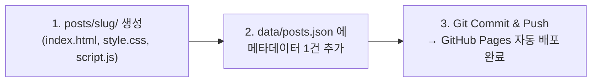
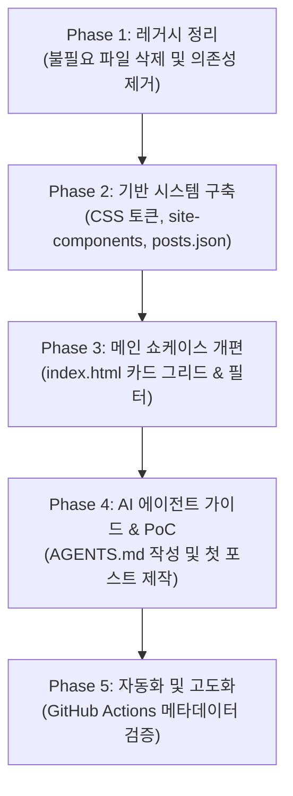

# Architecture & Transition Roadmap

> **프로젝트 명**: Jacob's Interactive Web Lab (`jacob3015.github.io`)  
> **호스팅 환경**: GitHub Pages (정적 사이트 호스팅)  
> **핵심 기술 스택**: Pure Web Standards (HTML5, CSS3, Vanilla ES Modules, Web Components)  
> **운영 방식**: AI 에이전트 자율 관리 및 컨텐츠 생성

---

## 1. 개요 및 전환 배경 (Overview & Background)

본 프로젝트는 GitHub Pages로 서빙되는 정적 웹 프로젝트로, 기존에는 마크다운 기반의 이력서 및 일부 텍스트 컨텐츠와 백엔드 스타일 바닐라 JS 코드가 혼재된 상태였습니다.

새로운 방향성은 다음과 같습니다:
1. **순수 웹 표준 (Pure JS · CSS · HTML)**:
   - 복잡한 번들러나 빌드 도구 없이 브라우저 네이티브 기능만으로 즉시 구동되는 정적 서빙 프로젝트로 전환합니다.
2. **AI 에이전트 자율 운영 (Agent-First Architecture)**:
   - AI 에이전트가 직접 프로젝트를 관리하고, 새로운 인터랙티브 컨텐츠(포스트)를 작성·게재·유지보수할 수 있도록 파일 구조와 프로토콜을 단순화하고 표준화합니다.
3. **텍스트 중심 탈피 → 클라이언트 사이드 인터랙티브 웹**:
   - 단순 텍스트/마크다운 블로그에서 벗어나, 서버 없이 브라우저 상에서 동작하는 시각화, 시뮬레이션, 오디오/비주얼 실험, 대화형 도구 등 **상호작용형 정적 웹 애플리케이션(Explorable Applet)**을 게재하는 공간으로 운영합니다.

---

## 2. 현재 상태 진단 및 레거시 분석 (Current State Analysis)

### 2.1 현재 구조의 한계
* **오버엔지니어링된 백엔드식 계층 구조**:
  - `Repository` - `Service` - `Component` - `Router` - `App`의 Java/Spring 스타일 구조가 바닐라 JS로 수동 구현되어 있습니다.
  - 추상 클래스(`MethodNotImplementedError`), 커스텀 에러 클래스, 이벤트 디스패처 래퍼 등 정적 웹 환경에 불필요한 보일러플레이트 코드가 다수 존재합니다.
* **AI 에이전트 작업 시 높은 결합도와 오류 위험**:
  - `index.html`에 27개의 모듈 경로가 `importmap`으로 하드코딩되어 있습니다.
  - 새 페이지를 하나 추가하려면 `importmap` 수정, 라우터 등록, 컴포넌트/서비스/레포지토리 생성 등 4~6개 파일을 동시에 수정해야 하므로, AI 에이전트의 컨텍스트 소모가 크고 파일 간 동기화 오류 발생률이 높습니다.
* **과거 특정 프로젝트(ESP) 종속성 잔재**:
  - 과거 영어 말하기 연습(ESP)을 위해 포함되었던 `.wav` 바이너리 음원 파일, 질문 목록 JSON, 전용 컴포넌트/서비스가 저장소에 남아 있습니다.

---

## 3. 불필요한 파일 선별 및 정리 목록 (Deprecation & Removal Inventory)

### 3.1 🗑️ [그룹 A] 과거 ESP 프로젝트 전용 잔여 파일 (완전 삭제 대상)
새로운 프로젝트 방향과 무관하며 저장소 용량을 차지하는 파일들입니다.

| 경로 | 사유 |
| :--- | :--- |
| `assets/wav/` 전체 (하위 디렉토리 및 `.wav` 파일 6개) | 과거 음성 학습용 바이너리 음원 파일 |
| `assets/json/questions/` 전체 (`*.json`) | 과거 ESP 질문 데이터 |
| `assets/json/synthesize-config.json` | 과거 TTS 합성 설정 파일 |
| `assets/json/topics.json` | 과거 ESP 토픽 목록 |
| `scripts/component/espComponent.js` | ESP 화면 렌더링 전용 컴포넌트 |
| `scripts/service/espServiceImpl.js` | ESP 비즈니스 로직 서비스 |
| `scripts/service/wavServiceImpl.js` | 음원 Blob 로딩 서비스 |
| `scripts/repository/wavRepositoryImpl.js` | 음원 파일 fetch 레포지토리 |
| `assets/html/templates/projects.html` | ESP 버튼 등이 하드코딩된 레거시 템플릿 |

### 3.2 🔄 [그룹 B] 과도한 추상화 및 레거시 마크다운 관련 파일 (정리/대체 대상)
순수 정적 웹과 AI 에이전트의 단순한 관리를 저해하는 계층 파일들입니다.

| 구분 | 경로 | 처리 방안 |
| :--- | :--- | :--- |
| **마크다운 파서** | `scripts/repository/markdownRepositoryImpl.js`<br>`scripts/service/markdownServiceImpl.js`<br>`scripts/component/aboutComponent.js`<br>`assets/md/about.md` | `about.md` 내용은 프로필/소개 페이지로 이관하고, CDN `marked.js` 및 마크다운 파서 계층은 삭제 |
| **추상 인터페이스 & 에러** | `scripts/service/service.js`<br>`scripts/repository/repository.js`<br>`scripts/error/` 하위 파일 전체 | 바닐라 JS 환경에 불필요한 가상 인터페이스 및 커스텀 에러 클래스 삭제 |
| **유틸리티 래퍼** | `scripts/util/eventFactory.js`<br>`scripts/util/eventDispatcher.js` | 브라우저 내장 `CustomEvent` / `EventTarget`으로 대체 가능하므로 삭제 |
| **레거시 템플릿/서비스** | `scripts/repository/htmlRepositoryImpl.js`<br>`scripts/service/htmlServiceImpl.js`<br>`scripts/repository/jsonRepositoryImpl.js`<br>`scripts/service/jsonServiceImpl.js`<br>`assets/html/templates/` 전체 | 템플릿 HTML fetch 방식 폐기 및 네이티브 시맨틱 HTML로 전환 |
| **레거시 앱 셸/라우터** | `scripts/component/layoutComponent.js`<br>`scripts/component/projectListComponent.js`<br>`scripts/app/app.js`<br>`scripts/handler/router.js`<br>`scripts/main.js` | 해시 기반 수동 라우터 및 주석투성이 레거시 코드 삭제 후 독립 디렉토리 구조로 전환 |

### 3.3  [그룹 C] 유지 및 재활용 대상 파일
* `assets/img/icons/` 전체 (`favicon.ico`, `favicon-16x16.png`, `apple-touch-icon.png`, `site.webmanifest` 등)
* `styles/layouts.css` *(모던 CSS 리셋 및 공통 디자인 시스템 토큰으로 개편)*
* `index.html` *(기존 importmap/marked 제거 후, 최신 인터랙티브 포스트 쇼케이스 홈으로 재구축)*
* `README.md` *(새로운 프로젝트 소개 및 문서 인덱스로 개편)*
* `.gitignore` *(유지)*

---

## 4. 새로운 아키텍처: Agent-First Interactive Static Web

### 4.1 핵심 원칙
1. **Self-Contained & Isolated Content (독립 완결형 컨텐츠)**:
   - 각 인터랙티브 컨텐츠(포스트)는 `posts/<slug>/` 디렉토리 안에 자체 `index.html`, `style.css`, `script.js`를 갖습니다.
   - 포스트마다 제각각의 라이브러리(Canvas, Web Audio, SVG 등)나 복잡한 DOM 조작을 하더라도, 메인 사이트나 다른 포스트의 CSS/JS와 충돌하지 않습니다.
2. **Single Source of Truth (`data/posts.json`)**:
   - 블로그 목록, 카테고리, 태그, 썸네일, 인터랙션 요약은 `data/posts.json` 단일 파일로 관리됩니다.
   - AI 에이전트는 신규 글 작성 시 `posts/<slug>/` 폴더를 생성하고 `posts.json`에 엔트리 1개만 추가하면 게재가 완료됩니다.
3. **Pure Web Standards & Zero-Build**:
   - 번들러나 컴파일 과정 없이 브라우저 네이티브 기술(ES Modules, CSS Nesting, `:has()`, Web Components)만으로 동작합니다.
4. **GitHub Pages 네이티브 호환**:
   - 각 포스트가 독립된 URL(`domain.com/posts/<slug>/`)을 가지므로 직접 접속과 새로고침 시 404 라우팅 해킹이 필요 없습니다.

### 4.2 목표 디렉토리 구조 (To-Be)

```text
jacob3015.github.io/
├── index.html                   # 메인 쇼케이스 홈 (인터랙티브 컨텐츠 카드 그리드, 필터, 소개)
├── 404.html                     # 404 안내 페이지
├── AGENTS.md                    # AI 에이전트 자율 관리 가이드 및 컨텐츠 생성 규약
├── README.md                    # 프로젝트 소개
├── docs/                        # 프로젝트 문서
│   └── ARCHITECTURE_AND_ROADMAP.md # [본 문서] 아키텍처 및 로드맵
├── data/
│   └── posts.json               # 전체 컨텐츠 메타데이터 (제목, 설명, 태그, 경로, 날짜)
├── assets/
│   ├── css/
│   │   ├── reset.css            # 모던 CSS 리셋
│   │   └── global.css           # 전역 CSS 변수 (테마 색상, 타이포그래피, 공통 유틸)
│   ├── js/
│   │   └── site-components.js   # 공통 <site-header>, <site-footer> Web Components
│   └── img/
│       ├── icons/               # 파비콘 및 PWA 매니페스트 에셋
│       └── covers/              # 포스트별 대표 썸네일/미리보기
└── posts/                       # 각 인터랙티브 컨텐츠 디렉토리
    ├── sorting-visualizer/      # 예시 1: 정렬 알고리즘 인터랙티브 시각화
    │   ├── index.html
    │   ├── style.css
    │   └── script.js
    └── audio-synthesizer/       # 예시 2: Web Audio API 기반 신시사이저
        ├── index.html
        └── app.js
```

### 4.3 메타데이터 스키마 (`data/posts.json`)

```json
[
  {
    "id": "sorting-visualizer",
    "title": "Interactive Sorting Algorithm Visualizer",
    "description": "다양한 정렬 알고리즘의 동작 과정을 클라이언트 사이드에서 시각화하고 제어하는 인터랙티브 웹앱",
    "category": "Algorithm",
    "tags": ["Visualization", "Algorithms", "Canvas"],
    "path": "/posts/sorting-visualizer/",
    "createdAt": "2026-10-01",
    "thumbnail": "/assets/img/covers/sorting-visualizer.png",
    "featured": true
  }
]
```

---

## 5. AI 에이전트 자율 관리 워크플로우

AI 에이전트가 새로운 인터랙티브 컨텐츠를 작성하고 배포할 때 따르는 2-Step 프로세스입니다:



### 5.1 에이전트 지침 (`AGENTS.md`) 핵심 규약
1. **자급자족성(Self-contained)**:
   - 포스트의 스타일과 스크립트는 해당 디렉토리 내에서 완결되어야 하며, 외부 공통 파일을 무단 수정하지 않습니다.
2. **반응형 및 모던 Web API 지향**:
   - 모바일과 데스크톱 모두에서 터치/마우스 인터랙션이 자연스럽게 작동해야 합니다.
   - 무거운 외부 라이브러리(React/Vue 등) 대신 네이티브 Canvas, Web Audio, SVG, Web Animations API 등을 우선 활용합니다.
3. **공통 레이아웃 연결**:
   - 필요한 경우 `<script type="module" src="/assets/js/site-components.js"></script>`를 불러와 상단 `<site-header>`, 하단 `<site-footer>` 태그만 선언하면 사이트 전체의 통일감이 유지됩니다.

---

## 6. 단계별 전환 로드맵 (Transition Roadmap)



### 📌 Phase 1: 레거시 정리 (Cleanup)
- [ ] 그룹 A(과거 ESP 전용 wav 음원 파일 6개, 질문 json, 관련 스크립트) 삭제.
- [ ] 그룹 B(과거 마크다운 파서, 백엔드식 인터페이스/에러 클래스, 레거시 템플릿) 삭제.
- [ ] `index.html`에서 불필요한 `importmap` 및 `marked.js` CDN 링크 제거.

### 📌 Phase 2: 기반 시스템 구축 (Foundation)
- [ ] `assets/css/reset.css` 및 `assets/css/global.css` (다크모드/라이트모드 CSS 변수, 타이포그래피) 작성.
- [ ] `assets/js/site-components.js` 작성 (공통 `<site-header>`, `<site-footer>` Web Components).
- [ ] `data/posts.json` 기본 구조 생성.

### 📌 Phase 3: 메인 쇼케이스 개편 (Showcase Home)
- [ ] `index.html`을 모던 시맨틱 마크업으로 개편.
- [ ] `data/posts.json`을 fetch하여 인터랙티브 컨텐츠 카드 그리드를 렌더링하는 클라이언트 사이드 스크립트 구현.
- [ ] 태그/카테고리 필터링 및 프로필 소개 영역 추가.
- [ ] `404.html` 안내 페이지 추가.

### 📌 Phase 4: AI 에이전트 가이드 수립 및 첫 인터랙티브 포스트 PoC (PoC & Guidelines)
- [ ] 루트에 `AGENTS.md` 작성 (AI 에이전트가 컨텐츠를 생산할 때 따를 상세 가이드라인).
- [ ] 첫 번째 인터랙티브 정적 웹 포스트 작성 (예: `posts/sorting-visualizer/` 또는 `posts/audio-synth/`).
- [ ] `data/posts.json`에 등록 후 메인 쇼케이스와의 연동 및 GitHub Pages 서빙 검증.

### 📌 Phase 5: 자동화 및 고도화 (Automation & Polish)
- [ ] `.github/workflows/validate-posts.yml` 추가: `posts.json`의 스키마 유효성 및 링크 깨짐 검사.
- [ ] 포스트 검색 기능 및 뷰 전환 애니메이션(View Transitions API) 적용.
