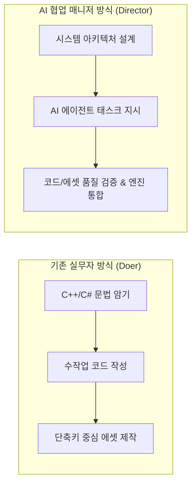

# AI 협업 기반 3D 액션 RPG 개발 매니저 학습 가이드

> **대상**: AI 에이전트를 개발 파트너로 활용하여 3D 싱글 플레이 액션 RPG(붉은사막 스타일) 개발을 총괄하고자 하는 1인 디렉터 / 테크니컬 매니저  
> **기준 학습 시간**: 1일 2시간 (주 5~6일 기준, 총 12주 완성 로드맵)  
> **핵심 도구**: Unreal Engine 5 (또는 Unity), Blender, AI Coding/Asset Agents

---

## 1. 패러다임 전환: 실무자(Doer)에서 테크니컬 디렉터(Manager)로

AI 에이전트를 적극적으로 활용하는 환경에서 개발자의 역할은 **"코드를 직접 타이핑하고 버텍스를 일일이 당기는 작업자"**에서 **"아키텍처를 설계하고, AI에게 정밀한 스펙을 지시하며, 산출물의 품질을 검증하는 디렉터"**로 근본적인 전환이 일어납니다.



### 💡 매니저에게 필요한 핵심 역량
1. **Mental Model (멘탈 모델)**: "엔진 내부에서 이 기능이 실제로 어떻게 돌아가는가?"에 대한 개념적 이해.
2. **Technical Specification (기술 명세 능력)**: AI가 환각(Hallucination) 없이 정확한 코드를 짜도록 입력/출력/상태머신/제약조건을 모듈 단위로 정의하는 능력.
3. **Review & Diagnostics (검증 및 진단)**: AI가 가져온 코드나 에셋에서 메모리 누수, 프레임 드랍, 조작감 저하의 원인을 찾아내고 재지시하는 능력.
4. **Tool Orchestration (도구 오케스트레이션)**: Blender ↔ Unreal/Unity 간의 데이터 변환 규약과 자동화 파이프라인 관리.

---

## 2. 매니저 관점의 5대 필수 학습 영역

직접 밑바닥 코드를 외울 필요는 없지만, **AI의 작업을 감독하기 위해 반드시 알아야 하는 영역**입니다.

### ① 게임 엔진 구조 및 라이프사이클 (Engine Architecture)
* **프레임 틱(Tick/Update)과 동기화**: 매 프레임 실행해야 할 로직과 이벤트 기반으로 실행해야 할 로직의 구분 (성능 최적화 지시의 기준).
* **메모리 및 객체 수명 관리**: 언리얼의 `UObject`, 스마트 포인터, GC(가비지 컬렉션), 유니티의 모노비헤이비어 수명 주기.
* **컴포넌트 기반 아키텍처 (Actor-Component)**: 결합도를 낮추어 AI에게 기능별(예: 체력 컴포넌트, 인벤토리 컴포넌트, 전투 컴포넌트)로 격리 개발을 지시하는 기초.

### ② 3D 에셋 & 애니메이션 파이프라인 (Asset Pipeline & Rigging)
* **좌표계 및 트랜스폼 규약**:
  * Blender(Z-up, -Y forward) ↔ Unreal(Z-up, X forward) ↔ Unity(Y-up, Z forward) 간의 축 변환 문제와 스케일(1m vs 1cm) 기준.
* **스켈레톤(Skeleton), 본(Bone), 소켓(Socket)**:
  * 인체 표준 본 네이밍(IK 본, 트위스트 본 등).
  * 무기를 쥐는 손 소켓(`hand_r_socket`)이나 등 뒤 무기 거치 소켓의 개념.
* **애니메이션 데이터 구조**:
  * 루트 모션(Root Motion) vs 제자리(In-place) 애니메이션의 차이점과 적용 기준.
  * 레터링/애니메이션 노티파이(Anim Notify)를 활용한 타격 판정 및 사운드 트리거 시점 설정.

### ③ 고급 모빌리티 & 애니메이션 합성 (Locomotion & IK)
* **상태 머신(FSM) vs 모션 매칭(Motion Matching)**:
  * 붉은사막 스타일의 유연한 움직임을 위해 언리얼 5의 Motion Matching 및 Pose Search Database 원리 이해.
* **절차적 IK (Control Rig & Two-Bone IK)**:
  * 경사면 지형에 발바닥을 맞추는 Foot IK의 원리(지형 레이캐스트 → 무릎 벤딩 각도 계산 → 골반 높이 보정).
  * AI에게 "Control Rig 노드 구조"를 물어보고 검증할 수 있는 수준의 이해.

### ④ 액션 전투 메커닉스의 정량적 이해 (Combat Mechanics)
* **타격감(Juice)의 파라미터화**:
  * 히트스톱(Hit-stop): 타격 순간 정지 시간 (예: 일반 타격 3~5프레임, 강타 8~12프레임).
  * 카메라 셰이크(Camera Shake): 진폭(Amplitude), 주파수(Frequency), 지속시간(Duration).
* **조작 반응성 설계**:
  * 입력 버퍼링(Input Buffering): 프레임 선입력 큐(Queue) 알고리즘.
  * 캔슬 윈도우(Cancel Window): 선딜레이 - 판정 구간 - 후딜레이 중 캔슬 가능한 타이밍 태깅.
* **정밀 판정**: 볼륨 충돌체(Capsule/Box) vs 무기 궤적 스윕(Anim Trail Sweep).

### ⑤ 게임 AI 및 월드 시스템 (AI & World Systems)
* **행동 트리(Behavior Tree) & 환경 쿼리 시스템(EQS)**:
  * NPC가 플레이어를 어떻게 인식하고, 어디로 이동하며, 언제 공격할지 결정하는 블랙보드-노드 구조.
* **토큰 시스템(Token-based Combat)**:
  * 다대일 전투에서 적들이 한꺼번에 때리지 않고 차례대로 공격하게 하는 교전 큐 시스템.

---

## 3. 일일 2시간 학습 운영 가이드 (Daily 2-Hour Routine)

매일 2시간을 무작정 튜토리얼을 따라하는 데 쓰면 실무 작업에 매몰되어 지칩니다. **"30분 개념 파악 → 60분 AI 페어 실습 → 30분 검증 및 블로그 정리"**의 3단계 루틴을 권장합니다.

```text
[ 00:00 ~ 00:30 ] 1단계: 멘탈 모델 학습 (이론/아키텍처 파악)
  - 공식 문서, GDC 강연, 테크 아티클 정독
  - "이 시스템을 만들려면 어떤 컴포넌트와 수학적 개념이 필요한가?" 구조화

[ 00:30 ~ 01:30 ] 2단계: AI 에이전트 페어 프로그래밍/실습
  - AI에게 명확한 기술 스펙을 제시하고 C++/C#/Python 스크립트 작성 요청
  - 엔진/블렌더에 올려서 즉시 결과 테스트 및 파라미터 튜닝

[ 01:30 ~ 02:00 ] 3단계: 리뷰 & 인터랙티브 컨텐츠화 (지식 자산화)
  - AI가 작성한 코드의 장단점 및 발생했던 트러블슈팅 기록
  - 블로그 인터랙티브 위젯(Canvas/Web 3D)으로 개념 시각화 정리
```

---

## 4. 12주 단계별 완성 로드맵 (12-Week Master Roadmap)

총 3개월 동안 매일 2시간씩 투자하여 **"기초 파이프라인 → 전투 프로토타입 → AI 에이전트 협업 체계 확립"**을 달성하는 커리큘럼입니다.

| 주차 | 단계명 | 핵심 학습 주제 (2시간/일) | AI 에이전트에게 지시할 과제 |
| :---: | :--- | :--- | :--- |
| **1주** | **파이프라인 확립** | Blender ↔ Engine 에셋 축/스케일/소켓 규약 | "Blender에서 캐릭터 본 소켓을 자동 배치하는 Python 스크립트 작성" |
| **2주** | **캐릭터 조작 기본** | Enhanced Input, 3인칭 카메라 스프링암 원리 | "벽 충돌 시 카메라 줌인과 숄더뷰 전환을 처리하는 카메라 컨트롤러" |
| **3주** | **이동 & 애니메이션** | 루트모션 vs 인플레이스, 2D 블렌드 스페이스 | "가속도와 회전각에 따라 대기-걷기-달리기를 블렌딩하는 로직" |
| **4주** | **절차적 IK (Foot IK)** | 레이캐스트 지형 감지, Two-Bone IK 수학 | "경사면에서 두 발의 높낮이와 발목 회전을 맞추는 Foot IK 시스템" |
| **5주** | **입력 버퍼 & FSM** | 액션 상태머신, 콤보 선입력 큐(Buffer Queue) | "연타 입력을 버퍼링하여 3단 콤보를 부드럽게 잇는 입력 매니저" |
| **6주** | **타격 판정 & 충돌체** | 무기 궤적 스윕(Anim Notify Sweep) 판정 | "무기 궤적을 따라 다중 구체 트레이스를 쏘아 피격체를 찾는 모듈" |
| **7주** | **타격감(Juice) 연출** | 히트스톱, 넉백 벡터, 절차적 카메라 셰이크 | "타격 시 0.08초 시간 정지 및 충격 방향 셰이크를 트리거하는 이펙터" |
| **8주** | **방어 메커닉스** | 패링(Parry) 타이밍 윈도우, 가드, 회피 무적 | "피격 직전 0.2초 내 방어 입력 시 반격을 허용하는 패링 시스템" |
| **9주** | **적 AI 기초 (BT)** | 내비메시(NavMesh), 행동 트리, 블랙보드 | "플레이어 발견 시 추적하고 사거리 내에서 대기하는 기본 적 AI" |
| **10주** | **다대일 전투 토큰** | 전투 템포 조율, 토큰 기반 교전 분배 | "주변 적 5명 중 1명에게만 공격 토큰을 지급하고 순환시키는 매니저" |
| **11주** | **장비 & 스탯 시스템** | 스켈레탈 메시 머징/소켓 바인딩, RPG 스탯 | "장비 탈착 시 스탯 변화와 무기 메시 소켓 교체를 처리하는 시스템" |
| **12주** | **프로파일링 & 최적화** | 렌더링 드로우콜, 틱 최적화, GC 스파이크 진단 | "프레임 저하를 일으키는 과도한 틱 연산 탐지 및 최적화 리팩토링" |

---

## 5. AI 에이전트 지시(Prompting) 및 코드 검증 체크리스트

AI에게 작업을 맡길 때 매니저가 항상 검토해야 하는 5대 체크포인트입니다:

```markdown
### 📋 AI 산출물 검증 체크리스트 (Manager's Checklist)

1. [ ] **Tick 의존성 확인**: "이 코드가 불필요하게 매 프레임(Tick/Update) 돌고 있는가? 이벤트 기반(Delegate/Event)으로 바꿀 수 없는가?"
2. [ ] **메모리 할당 확인**: "루프나 빈번한 함수 내에서 새 객체나 배열을 생성하여 GC(가비지 컬렉터) 스파이크를 일으키지 않는가?"
3. [ ] **확장성/모듈화**: "다른 액터나 컴포넌트와 강하게 결합(Hard Coupling)되어 있지 않은가? 인터페이스나 이벤트를 거치는가?"
4. [ ] **파라미터 노출**: "디자이너나 내가 에디터에서 수치(속도, 딜레이, 반경 등)를 즉시 튜닝할 수 있도록 변수가 노출(UPROPERTY / [SerializeField])되어 있는가?"
5. [ ] **에러 처리 & 널 체크**: "대상 포인터가 유효하지 않을 때(nullptr / null) 크래시가 나지 않도록 방어 코드가 들어가 있는가?"
```

---

## 6. 블로그 컨텐츠화 연계 방안 (Explorable Explanation)

학습한 내용을 본 블로그(`jacob3015.github.io`)의 **순수 웹 표준 인터랙티브 컨텐츠**로 게시하는 추천 워크플로우입니다:

1. **엔진 실습 중 발견한 핵심 메커닉 추상화**:
   - 예: "7주차 히트스톱과 타격감"을 공부했다면, 복잡한 엔진 코드가 아니라 **"타격감의 시각적 공식"**에 집중.
2. **웹 캔버스(Canvas 2D / Three.js) 미니 시뮬레이터 제작**:
   - AI 에이전트에게 `posts/combat-juice/` 작성을 지시:  
     *"슬라이더로 히트스톱 밀리초(ms)와 카메라 흔들림 강도를 조절하며 더미를 타격해볼 수 있는 캔버스 위젯을 만들어줘."*
3. **2-Step Publishing 배포**:
   - `posts/<slug>/` 디렉토리 생성 후 `data/posts.json`에 등록.
   - 독자가 웹 브라우저에서 직접 조작하며 액션 RPG의 내부 동작 원리를 이해할 수 있는 최고급 기술 블로그로 발전.
